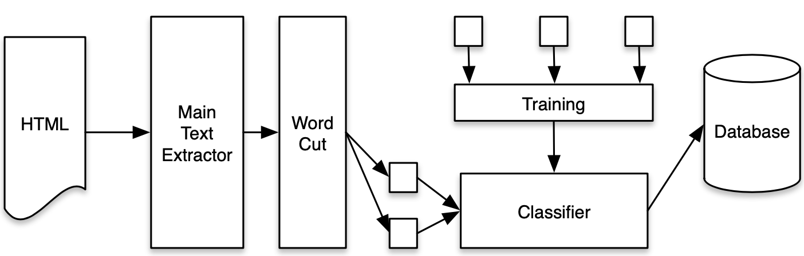

# fastProfileExtractor


 
Extract information from researchers' **homepages(HTML)** and classify the information into three classes(you can add more classes).
 
 **English** and **Chinese** pages are supported.
 
[Chinese README](https://www.omegaxyz.com/2020/06/18/fast-profile-extractor/)
 
## Class
- publication
- education
- honor

## Detail
The linear process of extracting and classifying academic behaviors from HTML is shown in the figure below. Before the formal extraction of academic behaviors, a small number of data on the Internet was first manually annotated. After the training set was generated, fastText was applied to generate the training model and save it.



Next, HTML metadata is obtained by Python crawler, and HTML data is passed into the text extraction algorithm WNBTE to obtain texts. Then, the text paragraphs are segmented at phrase level, and the segmented words are passed into the fastText for labeling.

## Project Structure
- ff_classifier: using fasttext to train automatically and predict academic behavior (<1s)
- text_toolkit.py: extracting pattern string
- profile_class.py: researchers' profile class
- html_extract.py: extracting html page
- demo.py: demo

## Result Example(part)
```bash
honor 0.7774751782417297 2013 Aug. 2013,     KSEM'13 Best Paper Award
----
honor 0.7579861879348755 2013 Aug. 2013,     CCML'13 Outstanding Student Paper Award
----
honor 0.5015735626220703 2012 Mar.2012,     Google Technology Student Expert Award
----
publication 0.7918424606323242  Hongyuan Zhu, Qi Liu*, Nicholas Jing Yuan*, Kun Zhang, Enhong Chen. Pop Music Generation: from Melody to Multi-style Arrangement. ACM Transactions on Knowledge Discovery from Data (ACM TKDD). (Accepted) [Data]
----
education 0.5010859370231628 2011 Teaching Assistant, Data Mining (Prof. Hui Xiong). Rutgers Business School, Rutgers University, Feb. 2011~May. 2011.
----
education 0.3986995816230774 2010 Development Engineer, Personalized Recommendation Team. Alibaba (China) Technology Co., Ltd.  Mar.2010~Aug.2010.
----
```

## PS
If you wanna improve extractors' efficiency or accuracy, you can add more training data in [ff_classifier/train_data.txt](ff_classifier/train_data.txt) or adjust training configuration in the line 20 in [ff_classifier/classifier.py](ff_classifier/classifier.py).

```bash
# Line 20
self.classifier = ff.train_supervised("ff_classifier/train_data.txt", epoch=100, dim=50, lr=0.1, wordNgrams=2, minCount=0, loss="softmax")
```
